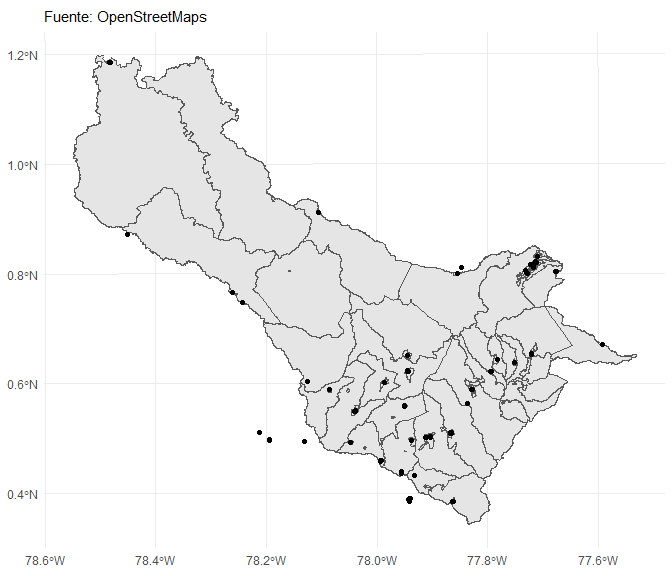
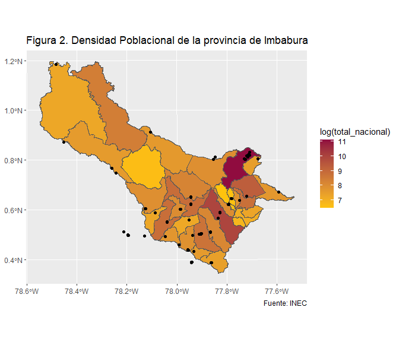
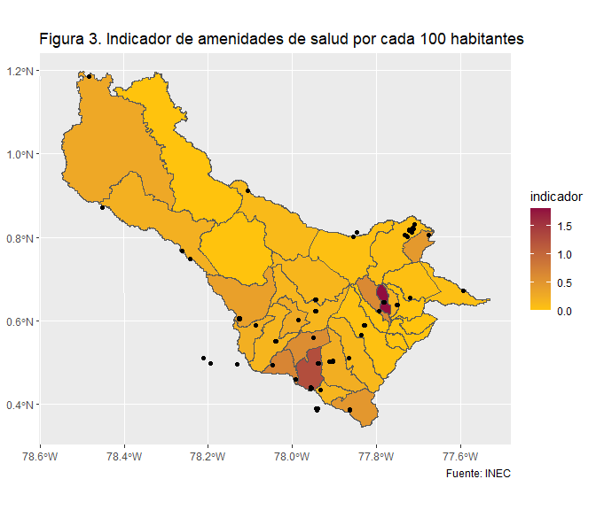
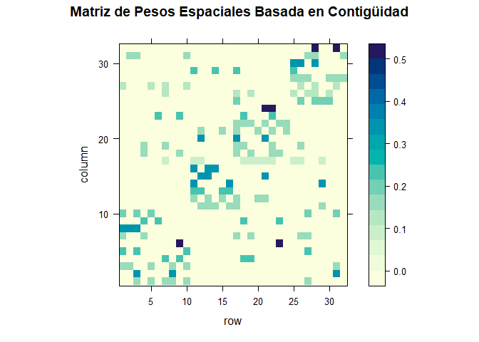
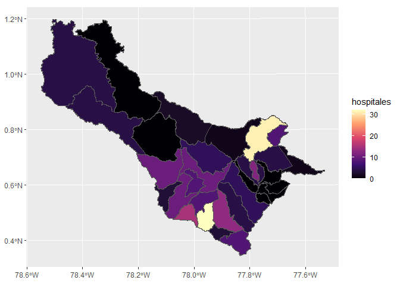

# Actividad Final
Jonathan Narváez
2024-01-01

# Parte 1: Indentificación y reflexión sobre las Amenidades de Salud

vamos a realizar la busquedad de hospitales y clinicas de la provincia
del carchi usando OpenStreet

``` r
#Vamos a importar las librerias
library(osmdata)
```

    Data (c) OpenStreetMap contributors, ODbL 1.0. https://www.openstreetmap.org/copyright

``` r
library(sf)
```

    Linking to GEOS 3.12.1, GDAL 3.8.4, PROJ 9.3.1; sf_use_s2() is TRUE

``` r
library(tidyverse)
```

    ── Attaching core tidyverse packages ──────────────────────── tidyverse 2.0.0 ──
    ✔ dplyr     1.1.4     ✔ readr     2.1.5
    ✔ forcats   1.0.0     ✔ stringr   1.5.1
    ✔ ggplot2   3.5.1     ✔ tibble    3.2.1
    ✔ lubridate 1.9.3     ✔ tidyr     1.3.1
    ✔ purrr     1.0.2     

    ── Conflicts ────────────────────────────────────────── tidyverse_conflicts() ──
    ✖ dplyr::filter() masks stats::filter()
    ✖ dplyr::lag()    masks stats::lag()
    ℹ Use the conflicted package (<http://conflicted.r-lib.org/>) to force all conflicts to become errors

``` r
library(readxl)
library(spdep)
```

    Cargando paquete requerido: spData
    To access larger datasets in this package, install the spDataLarge
    package with: `install.packages('spDataLarge',
    repos='https://nowosad.github.io/drat/', type='source')`

``` r
library(lattice)
```

``` r
#Creamos una lista con los lobres de cada una de las parroquias del carchi


lista_parroquias = c("Tulcán", "El Carmelo", "Julio Andrade", 
                     "Maldonado", "Pioter", "Tobar Donoso",
                     "Tufiño", "Urbina", "El Chical", 
                     "Santa Martha de Cuba", "Bolívar", "Garcia Moreno",
                     "Los Andes", "Monte Olivo", "San Vicente de Pusir",
                     "San Rafael", "El Ángel", "El Goaltal",
                     "La Libertad", "San Isidro", "Mira",
                     "Concepción", "Jijón y Caamaño", "Juan Montalvo")

#lista de amenidades
localizaciones = c("hospital", "clinic")

#Función para obtener los puntos dado una lista de parrquias
obtener_puntos <- function(zonas, provincia, pais, localizaciones) {
  
  # Inicializar lista_puntos como un data frame vacío
  lista_puntos <- data.frame(
    osm_id = character(),
    geometry = st_sfc(),  # Inicializar como un objeto sfc vacío
    stringsAsFactors = FALSE
  )
  
  for (zona in zonas) {
    # Obtener el bounding box para cada zona
    bbox <- getbb(paste(zona, provincia, pais, sep = ", "))
    
    # Construir la consulta y obtener los puntos
    query <- opq(bbox) %>% 
      add_osm_feature(key = "amenity", value = localizaciones) %>% 
      osmdata_sf()
    
    # Verificar si hay puntos disponibles antes de agregar
    if (!is.null(query$osm_points) && nrow(query$osm_points) > 0) {
      # Crear un nuevo data.frame con los resultados de la zona
      zona_puntos <- data.frame(
        osm_id = query$osm_points$osm_id,
        stringsAsFactors = FALSE
      )
      
      # Asignar la geometría
      zona_puntos$geometry <- query$osm_points$geometry
      
      # Combinar con el data.frame principal
      lista_puntos <- rbind(lista_puntos, zona_puntos)
     
    }
  }
  
  # Convertir el data.frame en un objeto sf para manejar geometría correctamente
  lista_puntos <- st_as_sf(lista_puntos, sf_column_name = "geometry", crs = 4326)
  
  return(lista_puntos)
}
#obtener_puntos(lista_parroquias,"Carchi", "Ecuador", localizaciones)
puntos <- obtener_puntos(lista_parroquias,"Carchi", "Ecuador", localizaciones = localizaciones)

#Numero de amenidades de hospitales de la provincia del ecuador
nrow(puntos)
```

    [1] 248

Decidí realizar un estudio primero de la parroquia de El Ángel para
analizar la cantidad de amenidades, pero al ser una parroquia pequeña,
me di cuenta de que no obtenía suficientes datos. Por ello, opté por
buscar los puntos de cada parroquia de la provincia de Carchi. Para
esto, inicialmente solicité a OpenStreetMap las amenidades de la
provincia, pero debido al uso de un bbox (cuadro delimitador), obtuve
resultados de amenidades fuera de la provincia.

Decidí entonces crear una función para consultar por parroquias, pero
encontré un problema: al buscar las amenidades por parroquia, detecté
que algunas de ellas también existen en otras provincias de Ecuador.
Finalmente, encontré 248 hospitales y clínicas en la provincia de
Carchi. No es necesario realizar la búsqueda por cada parroquia, pero
podría ser útil para un análisis por zonas territoriales en Ecuador.

# Parte 2: Unión de los polígonos de Zonas Censales a Nivel de Parroquias

Obtenemos la zona geometria de la provincia del carchi

``` r
# Lista las capas disponibles dentro del archivo GeoDatabase para identificar la que necesitamos.
st_layers("../data/GEODATABASE_NACIONAL_2021/GEODATABASE_NACIONAL_2021.gdb")
```

    Driver: OpenFileGDB 
    Available layers:
      layer_name     geometry_type features fields              crs_name
    1    aream_a     Multi Polygon     1847      8 WGS 84 / UTM zone 17S
    2     ca04_a     Multi Polygon  3951938      9 WGS 84 / UTM zone 17S
    3     ejes_l Multi Line String   546887      9 WGS 84 / UTM zone 17S
    4 ingresos_l Multi Line String  4153735      5 WGS 84 / UTM zone 17S
    5      loc_p             Point    59880      5 WGS 84 / UTM zone 17S
    6      man_a     Multi Polygon   234172     11 WGS 84 / UTM zone 17S
    7      sec_a     Multi Polygon    52898      7 WGS 84 / UTM zone 17S
    8      viv_p       Multi Point  5578282      9 WGS 84 / UTM zone 17S
    9      zon_a     Multi Polygon     5888      6 WGS 84 / UTM zone 17S

``` r
# Lee la capa "zon_a" desde el archivo GeoDatabase y la guarda en el objeto 'zonas'.
zonas <- st_read("../data/GEODATABASE_NACIONAL_2021/GEODATABASE_NACIONAL_2021.gdb",
                 layer = "zon_a")
```

    Reading layer `zon_a' from data source 
      `C:\Users\Jona\OneDrive\Documentos\projects\R\geo_estadistica\data\GEODATABASE_NACIONAL_2021\GEODATABASE_NACIONAL_2021.gdb' 
      using driver `OpenFileGDB'
    Simple feature collection with 5888 features and 6 fields
    Geometry type: MULTIPOLYGON
    Dimension:     XY
    Bounding box:  xmin: -685704.9 ymin: 9445216 xmax: 1147852 ymax: 10162550
    Projected CRS: WGS 84 / UTM zone 17S

``` r
# Filtra las zonas para mantener solo aquellas cuyo código comienza con "04".
zonas <- zonas %>% 
  filter(str_detect(zon, "^04"))
```

Para graficar empleamos el código del gráfico **ggplot2** y jugamos con
las opciones de Quarto chunks



Vamos a leer el archivo con la población del Ecuador por parroquias

``` r
# Lista las hojas disponibles en el archivo Excel para identificar la que necesitamos.
excel_sheets("../data/01_2022_CPV_Estructura_poblacional.xlsx")
```

     [1] "Índice" "1"      "1.1"    "1.2"    "2"      "2.1"    "3"      "4"     
     [9] "4.1"    "4.2"    "5"      "5.1"    "5.2"   

``` r
# Lee la hoja "1.2" del archivo Excel, en el rango específico de celdas B10:G1299, 
# y guarda los datos en el objeto 'poblacion'.
poblacion <- read_excel("../data/01_2022_CPV_Estructura_poblacional.xlsx", 
                        sheet = "1.2",
                        range = "B10:G1299"
                        )
```

    New names:
    • `` -> `...1`
    • `` -> `...2`
    • `` -> `...3`
    • `` -> `...4`

``` r
# Renombra las columnas del dataframe para hacerlas más descriptivas.
names(poblacion) <- c("provincia", "canton", "parroquia", "total_nacional", "hombres", "mujeres")
```

Limpiamos los resultados del censo:

``` r
# Filtra el dataframe para eliminar filas con valores NA en la columna 'provincia'
# y excluye filas donde la columna 'parroquia' contiene las palabras "Total" o "Nacional".
poblacion <- poblacion %>% 
  filter(!is.na(provincia), 
         str_detect(parroquia, "^Total|Nacional", negate = TRUE)) 

# Convierte los valores de las columnas 'provincia', 'canton', y 'parroquia' a mayúsculas para mantener uniformidad.
poblacion <- poblacion %>% 
  mutate(across(c(provincia, canton, parroquia), str_to_upper))
```

Ahora leemos la codificación DPA del INEC

``` r
# Lee la hoja "CODIGOS" del archivo Excel que contiene la codificación DPA.
dpa <- read_excel("../data/CODIFICACIÓN_2022.xlsx", sheet = "CODIGOS")
```

Vamos a acordamos de las funciones join:

``` r
# Realiza una unión izquierda (left join) entre la tabla de población y la tabla de codificación DPA.
poblacion <- poblacion %>% 
  left_join(dpa, by = c("provincia" = "DPA_DESPRO",   
                        "canton" = "DPA_DESCAN",     
                        "parroquia" = "DPA_DESPAR"   
                        ))
```

# Parte 3: Cálculo del Número de Amenidades

Nos queda unir los poligonos a nivel de parroquia por que estan a nivel
de zona censal

``` r
# Crea una nueva columna 'DPA_PARROQ' en el dataframe 'zonas' extrayendo los primeros 6 caracteres de la columna 'zon'.
zonas <- zonas %>% 
  mutate(DPA_PARROQ = str_sub(zon, 1, 6)) 

# Agrupa las geometrías por el código 'DPA_PARROQ' y realiza una unión espacial de las formas para consolidar los polígonos.
parroquias <- zonas %>% 
  group_by(DPA_PARROQ) %>%
  summarise(Shape = st_union(Shape)) 
```

Unimos los datos de poblacion:

``` r
# Realiza una unión de la tabla parroquias con la tabla poblacion usando left_join
parroquias <- parroquias %>% 
  left_join(poblacion)
```

    Joining with `by = join_by(DPA_PARROQ)`

Mapas de calor



En el mapa de calor, se observa que la mayor concentración de hospitales
se encuentra en la ciudad de Tulcán, que es la capital de la provincia
de Carchi. Esto es esperado, ya que las capitales provinciales suelen
contar con una mayor infraestructura de salud. Además, se destaca la
presencia significativa de hospitales en el cantón de Montúfar, que es
la segunda parroquia más grande en términos de población del cantón.
Esto puede indicar una distribución de servicios de salud que responde a
la densidad poblacional y a la importancia relativa de estas localidades
dentro de la provincia. \# Parte 4: Cálculo del Ratio de Amenidades por
habitante

Vamos al indicador de amenidades por cada 100 habitantes:

``` r
# 1. Transformar el sistema de coordenadas de los puntos para que coincida con el de las parroquias
puntos <- st_transform(x = puntos, crs = st_crs(parroquias))

# 2. Realizar una unión espacial entre los puntos (hospitales) y las parroquias.
# Se usa 'st_within' para identificar qué puntos están dentro de cada parroquia.
parroquias_puntos <- st_join(x = puntos, y = parroquias, join = st_within)

# 3. Contar el número de puntos (hospitales) por cada parroquia y guardar el resultado en una tabla.
# La variable 'DPA_PARROQ' representa el código de identificación de las parroquias.
# La nueva columna se llamará 'hospitales', que indicará el número de hospitales en cada parroquia.
parroquias_puntos <- parroquias_puntos %>% 
  count(DPA_PARROQ, name = "hospitales") %>% 
  as_tibble()

# 4. Realizar una unión (left join) entre la tabla de parroquias original y la tabla con el conteo de hospitales.
# De este modo, se añade la información del número de hospitales a la geometría de las parroquias.
parroquias <- parroquias %>% 
  left_join(parroquias_puntos)
```

    Joining with `by = join_by(DPA_PARROQ)`

``` r
# 5. Reemplazar los valores faltantes (NA) en la columna 'hospitales' por 0.
# Esto asegura que las parroquias sin hospitales no tengan valores faltantes, sino que aparezcan con 0.
parroquias <- parroquias %>% 
  mutate(hospitales = replace_na(hospitales, 0))
```

Calculamos el indicador



En la provincia de Carchi, se puede observar que el cantón de Tulcán
concentra la mayor cantidad de amenidades de salud. Esto refleja una
tendencia común en la cual los centros de salud se localizan en las
cabeceras cantonales debido a su importancia administrativa y su mayor
densidad poblacional. La concentración de estas amenidades en Tulcán
resalta su rol como el principal centro de servicios de salud en la
provincia, lo que probablemente se debe a su estatus como capital
provincial y a su mayor infraestructura en comparación con otros
cantones.

#Parte 5: Cálculo del indice de Moran para el indicador de Amenidades de
salud

``` r
# 1. Crear una lista de vecinos para las parroquias utilizando el método 'queen'.
# Esto significa que cada parroquia considera como vecina a cualquier otra parroquia
# que comparta al menos un punto en común.
vecinos <- poly2nb(parroquias, queen = TRUE)

# 2. Convertir la lista de vecinos en un objeto de pesos espaciales.
# 'style = "W"' indica que se utilizarán pesos binarios (1 si son vecinos, 0 si no).
vecinos_pesos <- nb2listw(vecinos, style = "W")

# 3. Convertir los pesos espaciales en una matriz.
matriz <- listw2mat(vecinos_pesos)

# 4. Obtener el número de columnas de la matriz de pesos.
ncol(matriz)
```

    [1] 32

``` r
# 5. Obtener el número de filas de la matriz de pesos.
nrow(matriz)
```

    [1] 32

visualizamos la matriz de vecindad

``` r
# 1. Crear un gráfico de nivel de la matriz de pesos espaciales.
# 't(matriz[1:32, 1:32])' transpone la matriz y selecciona las primeras 32 filas y columnas
# para visualizar solo una parte de la matriz, si es necesario.
levelplot(t(matriz[1:32, 1:32]), 
          
          # Configurar los ejes y las etiquetas del gráfico
          scales = list(y = list(at = seq(10, 50, by = 10), 
                                 labels = seq(10, 50, by = 10))), 
          
          # Título del gráfico
          main = "Matriz de Pesos Espaciales Basada en Contigüidad")
```



Calculo del indice de moran

``` r
# 1. Realizar la prueba de Moran sobre la variable 'hospitales'
# utilizando la lista de pesos espaciales 'vecinos_pesos'.
moran <- moran.test(parroquias$hospitales, listw = vecinos_pesos) 

# 2. Mostrar el resultado de la prueba de Moran.
moran
```


        Moran I test under randomisation

    data:  parroquias$hospitales  
    weights: vecinos_pesos    

    Moran I statistic standard deviate = 2.3609, p-value = 0.009116
    alternative hypothesis: greater
    sample estimates:
    Moran I statistic       Expectation          Variance 
           0.20649384       -0.03225806        0.01022700 

Calculo de indice local de moran

``` r
# 1. Calcular el índice de Moran local para la variable 'hospitales'
# utilizando la lista de pesos espaciales 'vecinos_pesos'.
local_moran <- localmoran(parroquias$hospitales, listw = vecinos_pesos)
```

``` r
# Muestra las primeras 6 filas del tibble local_moran para revisar su contenido
head(local_moran)
```

              Ii         E.Ii     Var.Ii       Z.Ii Pr(z != E(Ii))
    1 -0.4285999 -0.328048576 0.97970092 -0.1015876      0.9190840
    2  0.2378125 -0.016763364 0.16409098  0.6284559      0.5297053
    3 -0.1204737 -0.003510627 0.01554801 -0.9380187      0.3482348
    4  0.3872311 -0.011249951 0.08008841  1.4080654      0.1591117
    5  0.3918755 -0.016386671 0.11605066  1.1984374      0.2307468
    6  0.1948181 -0.003510627 0.05410708  0.8526261      0.3938667

Integramos los resultados del indice de Moran Local y los atributos de
objetos resultantes

``` r
# Extrae los cuadrantes (clusters) de los atributos del objeto local_moran
clusters <- attributes(local_moran)$quadr

# Combina los datos espaciales de las parroquias con los cuadrantes de clusters
parroquias_zonas <- bind_cols(parroquias, clusters)

# Convierte el objeto local_moran a un tibble para facilitar su manipulación
local_moran <- local_moran %>% 
  as_tibble()

# Combina los datos parroquias_zonas con las estadísticas locales de Moran
parroquias_zonas <- parroquias_zonas %>% 
  bind_cols(local_moran)

# Crea un gráfico utilizando ggplot con datos espaciales de parroquias
plot_1 <- parroquias %>% 
  ggplot() + 
  # Rellena las áreas de las parroquias basado en la variable hospitales
  geom_sf(aes(fill = hospitales)) + 
  # Aplica una escala de color continua con la paleta Viridis
  scale_fill_viridis_c(option = "A")
plot_1
```



Dado que el valor p es menor que 0.05, rechazamos la hipótesis nula de
ausencia de autocorrelación espacial. Esto nos permite concluir que
existe una autocorrelación espacial significativa en el promedio del
número de hospitales por cada 100 habitantes. En otras palabras, la
distribución espacial de los hospitales no es aleatoria; los valores
tienden a agruparse de manera que algunas áreas presentan una
concentración mayor o menor de hospitales en función de su proximidad
geográfica.
